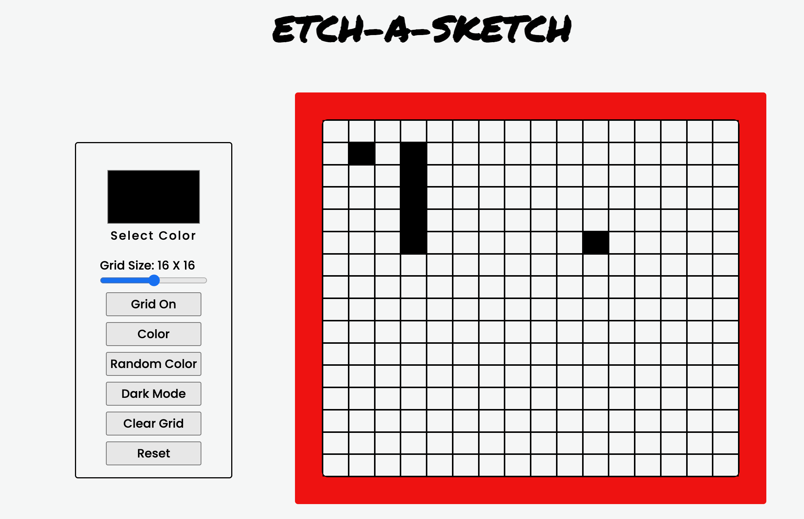

<h1>🎨 Interactive Etch-A-Sketch</h1>

A fun, browser-based drawing grid inspired by the classic Etch-A-Sketch toy. Built using HTML, CSS, and JavaScript, this project lets users draw by hovering over a customizable grid. Great for practicing DOM manipulation, event handling, and dynamic styling!

<h2>🚀 Features</h2>

<ul>
    <li>Adjustable grid size</li>
    <li>Hover-to-draw interaction</li>
    <li>Clear grid button to reset</li>
    <li>Toggle color mode: black or random (rainbow)</li>
    <li>Simple and responsive design</li>
</ul>

<h2>🛠️ Built With</h2>

<ul>
    <li>HTML5</li>
    <li>CSS3 (Flexbox/Grid)</li>
    <li>Vanilla JavaScript (ES6)</li>
</ul>

<h2>🎯 How to Use</h2>

<ul>
    <li>Use the input or slider to select the grid size.</li>
    <li>Hover your mouse over the grid to draw.</li>
    <li>Use buttons to:
        <ul>
            <li>Change color mode</li>
            <li>Clear the grid</li>
            <li>Regenerate grid with new size</li>
        </ul>
    </li>
</ul>